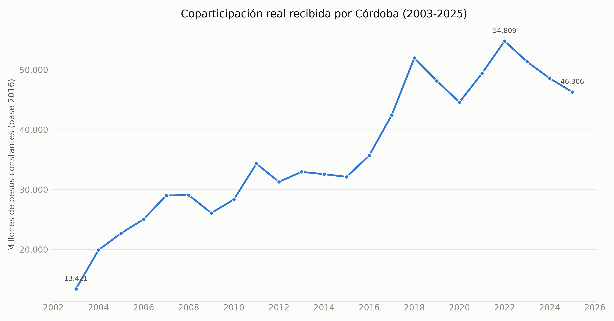
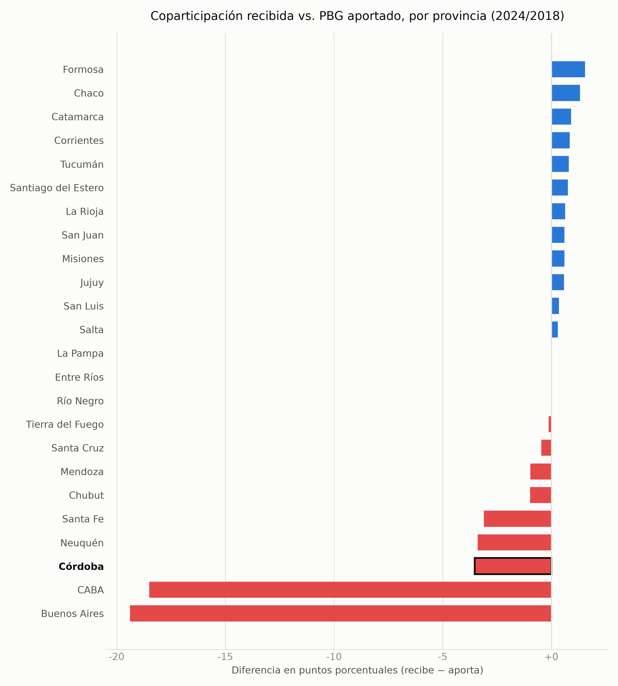
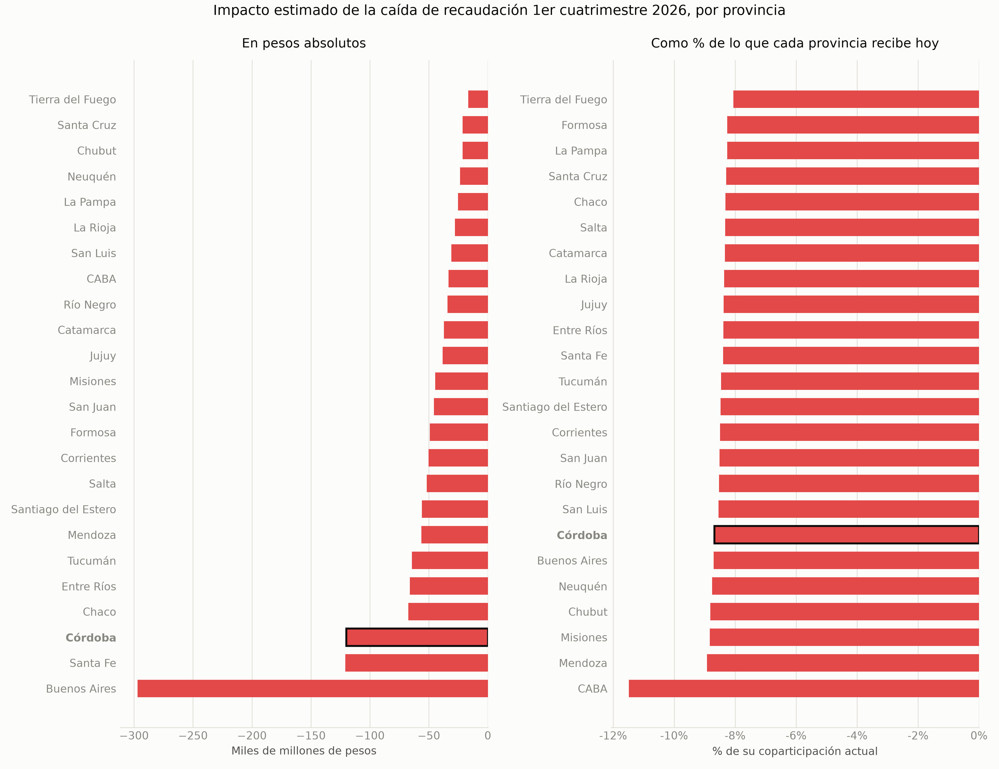
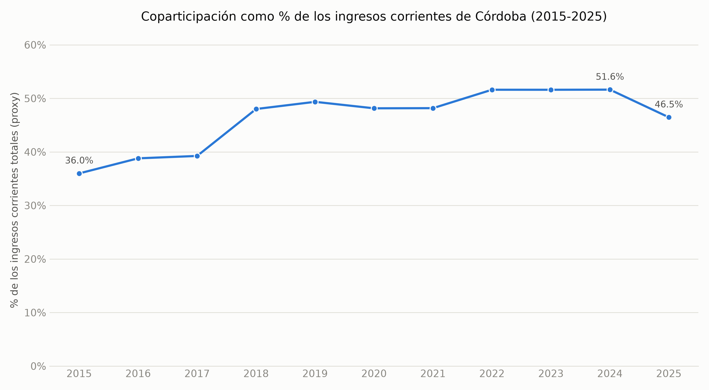

# Portafolio-Lorenzo

Análisis de datos del régimen de coparticipación federal de impuestos en Argentina, con foco en la provincia de Córdoba.

## Objetivo del proyecto

Este repositorio es una pieza de portfolio técnico para postular a consultoras de análisis fiscal (perfil IERAL, IARAF). Aborda un problema concreto de economía pública argentina — cómo se reparten los recursos tributarios entre Nación y provincias bajo el régimen de coparticipación federal (Ley 23.548) — desde cuatro ángulos complementarios: su evolución histórica, si cada provincia recibe en proporción a lo que aporta, qué tan sensible es el reparto a shocks de recaudación, y qué tan expuesta queda una provincia concreta (Córdoba) a esos shocks. Puede servirle a alguien evaluando perfiles para análisis fiscal/económico como muestra de trabajo con datos públicos argentinos: limpieza y trazabilidad de fuentes, decisiones metodológicas explícitas, y comunicación de resultados con sus limitaciones a la vista.

## Principales hallazgos

- **Serie histórica (2003-2025)**: la coparticipación real recibida por Córdoba (pesos constantes, base 2016) pasó de $13.421 millones en 2003 a un pico de $54.809 millones en 2022, y cerró 2025 en $46.306 millones — casi 3,5 veces el nivel de 2003, pero un 15% por debajo del pico de 2022.
- **Aporte vs. recibo por provincia**: Córdoba aporta el 8,6% del PBG nacional pero recibe solo el 5,0% de la coparticipación — una brecha de -3,5 puntos porcentuales, la tercera peor del país después de Buenos Aires y CABA.
- **Simulador de sensibilidad**: validado contra la caída de recaudación del primer cuatrimestre de 2026 reportada por IARAF, el modelo estima que una caída del 8,6% en la recaudación nacional coparticipable le cuesta a Córdoba unos $120.100 millones de pesos.
- **Dependencia fiscal de Córdoba (2015-2025)**: la coparticipación pasó de explicar el 36,0% de los ingresos corrientes de Córdoba en 2015 a un pico de 51,6% en 2022-2024, y bajó a 46,5% en 2025 (último año analizado). Con ese nivel de dependencia, una caída del 10% en la recaudación nacional coparticipable reduce los ingresos corrientes totales de la provincia en aproximadamente 4,7%.

## Núcleos de análisis

| Núcleo | Descripción | Notebook |
|---|---|---|
| 1 | Serie histórica de coparticipación (2003-2025) | [`01_serie_historica.ipynb`](notebooks/01_serie_historica.ipynb) |
| 2 | Aporte vs. recibo por provincia | [`02_aporte_vs_recibo.ipynb`](notebooks/02_aporte_vs_recibo.ipynb) |
| 3 | Simulador de sensibilidad | [`03_simulador_sensibilidad.ipynb`](notebooks/03_simulador_sensibilidad.ipynb) |
| 4 | Peso de la coparticipación en las cuentas de Córdoba | [`04_dependencia_fiscal_cordoba.ipynb`](notebooks/04_dependencia_fiscal_cordoba.ipynb) |

Metodología completa (fuentes, supuestos y limitaciones de cada núcleo) en [`docs/methodology.md`](docs/methodology.md).

### Núcleo 1 — Serie histórica de coparticipación



### Núcleo 2 — Aporte vs. recibo por provincia



### Núcleo 3 — Simulador de sensibilidad



### Núcleo 4 — Peso de la coparticipación en las cuentas de Córdoba



## Simulador interactivo

El Núcleo 3 incluye un simulador interactivo (slider de `ipywidgets`) dentro de `notebooks/03_simulador_sensibilidad.ipynb` — se eligió esa opción en vez de una app Streamlit separada para mantener todo el proyecto reproducible desde notebooks, sin depender de un proceso servidor aparte (ver la justificación completa en `docs/methodology.md`). No hay, por lo tanto, ninguna app Streamlit para deployar en este proyecto. Si en el futuro se quisiera una versión web del simulador (además de la interactiva del notebook), los pasos serían:

1. Extraer la lógica de `scripts/simulator.py` (ya está aislada y sin dependencias de notebook) a un pequeño script `app.py` con `streamlit` como única dependencia nueva de UI.
2. Probar localmente con `streamlit run app.py`.
3. Crear una cuenta en [Streamlit Community Cloud](https://streamlit.io/cloud), conectar este repositorio de GitHub, y apuntar el deploy a `app.py` — es gratuito para repositorios públicos.
4. Agregar el link resultante acá, en esta sección.

## Estructura del repositorio

```
data/raw/          # Datos crudos, tal como se obtuvieron. Nunca se editan a mano.
data/processed/    # Datos limpios, generados por los scripts de scripts/.
scripts/           # Código reutilizable: descarga (no verificada), procesamiento, simulador, tests.
notebooks/         # Un notebook por núcleo temático, con los gráficos e interpretación.
docs/              # Metodología: fuentes, supuestos y limitaciones de cada núcleo.
output/figures/    # Gráficos exportados (PNG), embebidos en este README y en los notebooks.
run_all.py         # Corre todo el pipeline de procesamiento + notebooks con un solo comando.
```

## Fuentes de datos

| Fuente | Organismo | Núcleo(s) |
|---|---|---|
| [Coparticipación / Recursos de Origen Nacional (RON)](https://www.argentina.gob.ar/economia/sechacienda/asuntosprovinciales/ron) | Secretaría de Hacienda, Ministerio de Economía de la Nación | 1, 3, 4 |
| [Índice de Precios al Consumidor, 2016-2025](https://www.indec.gob.ar/ftp/cuadros/economia/serie_ipc_divisiones.csv) | INDEC | 1 |
| Índice de Precios al Consumidor, 2003-2015 (archivo provisto por el autor, sin URL pública verificada) | Fundación Norte y Sur / Orlando J. Ferreres | 1 |
| Producto Bruto Geográfico por provincia (`Jurisdiccion_52sectores.xlsx`, archivo provisto por el autor) | CEPAL, sobre metodología base de INDEC | 2 |
| Índices de distribución de la coparticipación federal (`indices_copa_2018.pdf`, archivo provisto por el autor) | Documento tipo Secretaría de Hacienda / BNA | 2, 3, 4 |
| Recaudación provincial (`serie_recaudacion_provincial.xlsx`, archivo provisto por el autor) | Dirección General de Rentas de Córdoba | 4 |

Ninguna de estas fuentes tiene una licencia restrictiva conocida para su uso en un análisis de este tipo (son estadísticas públicas o compilaciones de acceso que el autor ya tenía), pero no todas tienen una URL pública verificada de origen — el detalle exacto de cómo se obtuvo cada archivo, con qué alcance temporal y qué limitaciones tiene, está en [`data/raw/README.md`](data/raw/README.md) y en [`docs/methodology.md`](docs/methodology.md).

## Cómo correr el proyecto de punta a punta

```bash
# Clonar el repositorio
git clone https://github.com/llorenzomagnano-sys/Portafolio-Lorenzo.git
cd Portafolio-Lorenzo

# Crear y activar un entorno virtual
python -m venv venv
source venv/bin/activate      # En Windows: venv\Scripts\activate

# Instalar dependencias
pip install -r requirements.txt

# Correr todo el pipeline: procesamiento de los 4 núcleos + tests + regeneración
# de los 4 notebooks (con sus gráficos). data/raw/ ya viene poblada en el repo.
python run_all.py
```

Para explorar de forma interactiva en vez de solo regenerar: `jupyter notebook` y abrir cualquiera de los notebooks de `notebooks/`. Para correr solo los tests del simulador: `pytest scripts/test_simulator.py`.

## Limitaciones metodológicas (resumen)

Cada una de estas se documenta en detalle, con la decisión tomada y su razón, en [`docs/methodology.md`](docs/methodology.md):

- **Núcleo 1** no llega a 1990 (el pedido original) porque no existe una fuente de montos nominales de coparticipación por provincia para 1990-2002; el rango quedó en 2003-2025. El tramo 2003-2015 depende de un IPC empalmado con una fuente privada (Ferreres/Norte y Sur) para 2007-2015, porque el IPC oficial de esos años está desacreditado por la intervención del INDEC.
- **Núcleo 2** usa el PBG como proxy del aporte tributario real, que tiene un problema de atribución geográfica conocido (las empresas suelen tributar donde tienen sede fiscal, no donde generan la actividad económica) — probablemente infla el aporte de CABA y subestima el de provincias productivas como Córdoba.
- **Núcleo 3** valida el simulador contra una única fuente (IARAF, un cuatrimestre) mediante una calibración/chequeo de consistencia interna, no contra una fuente independiente de recaudación coparticipable real — se documenta así explícitamente en vez de sobrevender la validación.
- **Núcleo 4** usa como "ingresos corrientes totales" de Córdoba una proxy (recaudación administrada por la Dirección General de Rentas) que excluye lo recaudado por otros organismos provinciales como EPEC, y el indicador de sensibilidad es una simplificación de primera ronda que no modela respuestas de política provincial ante una caída de ingresos.

## Licencia

Este proyecto está bajo licencia MIT. Ver [LICENSE](LICENSE) para más detalles. Los datos de `data/raw/` conservan la licencia/términos de sus fuentes originales (estadísticas públicas u organismos oficiales); no se redistribuyen bajo la licencia MIT del código.

## Autor

**Lorenzo Magnano**
