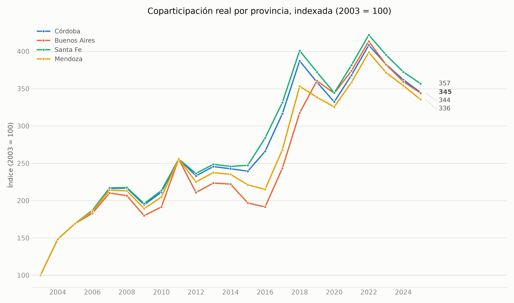
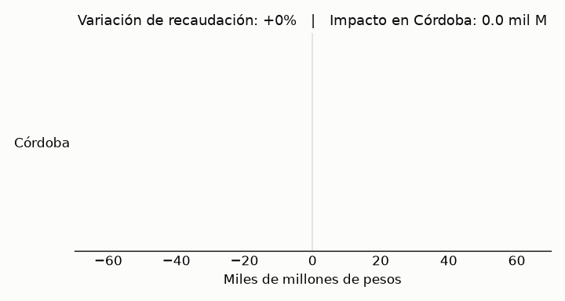

# Portafolio-Lorenzo

[](https://github.com/llorenzomagnano-sys/Portafolio-Lorenzo/actions/workflows/ci.yml)

Análisis de datos del régimen de coparticipación federal de impuestos en Argentina, con foco en la provincia de Córdoba.

## Sobre este proyecto

La coparticipación federal es uno de esos temas que aparecen todo el tiempo en la agenda económica argentina — un gobernador reclamando por su provincia, un cambio de coeficientes generando discusión — pero que casi nunca se explican con números concretos y trazables. Armé este repositorio para entender mejor cómo funciona el reparto de la Ley 23.548 en la práctica, tomando a Córdoba como caso de estudio en vez de quedarme en generalidades sobre todo el país.

Lo organicé en cuatro preguntas que se van encadenando: cómo evolucionó en el tiempo la coparticipación real que recibe Córdoba, si la provincia recibe en proporción a lo que aporta, qué tan sensible es ese reparto a un shock de recaudación, y qué tan dependiente es el presupuesto provincial de esa plata. De dónde sale cada dato, qué supuestos tomé y dónde flaquean queda documentado a la vista en vez de escondido en un anexo — es la parte del trabajo que más tiempo me llevó.

## Principales hallazgos

- **Serie histórica (2003-2025)**: la coparticipación real recibida por Córdoba (pesos constantes, base 2016) pasó de $13.421 millones en 2003 a un pico de $54.809 millones en 2022, y cerró 2025 en $46.306 millones — casi 3,5 veces el nivel de 2003. En términos relativos (indexado a 2003=100), sin embargo, Córdoba creció prácticamente igual que Buenos Aires, Santa Fe y Mendoza (entre 335 y 357 puntos en 2025): el salto responde a la dinámica agregada del régimen, no a algo particular de cada provincia.
- **Aporte vs. recibo por provincia**: Córdoba aporta el 8,6% del PBG nacional pero recibe solo el 5,0% de la coparticipación — una brecha de -3,5 puntos porcentuales, la tercera peor del país después de Buenos Aires y CABA.
- **Simulador de sensibilidad**: usando como referencia una caída de recaudación real de comienzos de 2026 (una cifra que dio a conocer IARAF), el modelo estima que una baja del 8,6% en la recaudación nacional coparticipable le cuesta a Córdoba unos $120.100 millones de pesos — un 8,7% de lo que recibe hoy, casi igual que el resto de las provincias salvo CABA (-11,5%, eco de su coeficiente ajustado en el Núcleo 2).
- **Dependencia fiscal de Córdoba (2015-2025)**: la coparticipación pasó de explicar el 36,0% de los ingresos corrientes de Córdoba en 2015 a un pico de 51,6% en 2022-2024, y bajó a 46,5% en 2025 (último año analizado). Con ese nivel de dependencia, una caída del 10% en la recaudación nacional coparticipable reduce los ingresos corrientes totales de la provincia en aproximadamente 4,7%.

## Núcleos de análisis

| Núcleo | Descripción | Notebook |
|---|---|---|
| 1 | Serie histórica de coparticipación (2003-2025) | [`01_serie_historica.ipynb`](notebooks/01_serie_historica.ipynb) |
| 2 | Aporte vs. recibo por provincia | [`02_aporte_vs_recibo.ipynb`](notebooks/02_aporte_vs_recibo.ipynb) |
| 3 | Simulador de sensibilidad | [`03_simulador_sensibilidad.ipynb`](notebooks/03_simulador_sensibilidad.ipynb) |
| 4 | Peso de la coparticipación en las cuentas de Córdoba | [`04_dependencia_fiscal_cordoba.ipynb`](notebooks/04_dependencia_fiscal_cordoba.ipynb) |

La metodología completa — fuentes, supuestos y limitaciones de cada núcleo — está en [`docs/methodology.md`](docs/methodology.md).

### Núcleo 1 — Serie histórica de coparticipación


En niveles absolutos Buenos Aires tapa todo por su tamaño, así que agregué también la misma serie indexada a 2003=100:



### Núcleo 2 — Aporte vs. recibo por provincia


### Núcleo 3 — Simulador de sensibilidad

En pesos absolutos y como % de lo que cada provincia recibe hoy — esta segunda vista es la que responde "qué tan grave es esto para cada una":


Demo del simulador (slider de `ipywidgets` en el notebook) recorriendo distintos escenarios de shock, generada con `scripts/build_demo_gif.py`:



**[Probar el simulador en el navegador →](https://claude.ai/code/artifact/a3bb99d1-699f-4ce6-96b9-b9086ee63e35)** — misma fórmula de `simular_shock`, reimplementada en JavaScript para no depender de Jupyter. Abre en el mismo escenario de referencia (-8,6% de shock → -8,7% de la coparticipación de Córdoba) que usé para chequear el modelo contra la cifra pública de comienzos de 2026. Los números que usa son una foto de los datos de 2025 (ver la limitación en `docs/methodology.md`); el detalle completo con las 24 jurisdicciones sigue estando en el notebook.

### Núcleo 4 — Peso de la coparticipación en las cuentas de Córdoba


## Simulador interactivo

El Núcleo 3 tiene un simulador interactivo (slider de `ipywidgets`) dentro de `notebooks/03_simulador_sensibilidad.ipynb`, más la versión standalone linkeada arriba. Elegí `ipywidgets` en vez de armar una app Streamlit aparte para que todo el proyecto se pudiera reproducir desde los notebooks sin depender de un servidor corriendo aparte (el porqué completo está en `docs/methodology.md`). La lógica del simulador (`scripts/simulator.py`) ya está separada y sin dependencias de notebook, así que si en algún momento quiero una versión web con Streamlit, sería cuestión de exponerla en un `app.py` chico y deployarla en Streamlit Community Cloud.

## Estructura del repositorio

```
data/raw/          # Datos crudos, tal como se obtuvieron. Nunca se editan a mano.
data/processed/    # Datos limpios, generados por los scripts de scripts/.
scripts/           # Código reutilizable: descarga (no verificada), procesamiento, simulador, tests.
notebooks/         # Un notebook por núcleo temático, con los gráficos e interpretación.
docs/              # Metodología: fuentes, supuestos y limitaciones de cada núcleo.
output/figures/    # Gráficos exportados (PNG), embebidos en este README y en los notebooks.
run_all.py         # Corre todo el pipeline de procesamiento + notebooks con un solo comando.
```

## Fuentes de datos

| Fuente | Organismo | Núcleo(s) |
|---|---|---|
| [Coparticipación / Recursos de Origen Nacional (RON)](https://www.argentina.gob.ar/economia/sechacienda/asuntosprovinciales/ron) | Secretaría de Hacienda, Ministerio de Economía de la Nación | 1, 3, 4 |
| [Índice de Precios al Consumidor, 2016-2025](https://www.indec.gob.ar/ftp/cuadros/economia/serie_ipc_divisiones.csv) | INDEC | 1 |
| Índice de Precios al Consumidor, 2003-2015 (archivo propio, sin URL pública verificada) | Fundación Norte y Sur / Orlando J. Ferreres | 1 |
| Producto Bruto Geográfico por provincia (`Jurisdiccion_52sectores.xlsx`, archivo propio) | CEPAL, sobre metodología base de INDEC | 2 |
| Índices de distribución de la coparticipación federal (`indices_copa_2018.pdf`, archivo propio) | Documento tipo Secretaría de Hacienda / BNA | 2, 3, 4 |
| Recaudación provincial (`serie_recaudacion_provincial.xlsx`, archivo propio) | Dirección General de Rentas de Córdoba | 4 |

Ninguna de estas fuentes tiene una licencia restrictiva conocida para este tipo de análisis (son estadísticas públicas o compilaciones a las que ya tenía acceso), pero no todas tienen una URL pública verificada de origen. El detalle de cómo conseguí cada archivo, con qué alcance temporal y qué limitaciones tiene, está en [`data/raw/README.md`](data/raw/README.md) y en [`docs/methodology.md`](docs/methodology.md).

**Atribución**: la serie de precios 2003-2015 usada en el Núcleo 1 se basa en la compilación histórica de series económicas de Argentina realizada por **Orlando J. Ferreres** para la **Fundación Norte y Sur**, conocido por su obra de referencia *"Dos siglos de Economía Argentina"*. La uso acá solo como insumo — un índice de precios empalmado con fuentes oficiales, con el detalle en la metodología — y no reclamo ninguna autoría sobre la compilación original.

## Cómo correr el proyecto de punta a punta

```bash
# Clonar el repositorio
git clone https://github.com/llorenzomagnano-sys/Portafolio-Lorenzo.git
cd Portafolio-Lorenzo

# Crear y activar un entorno virtual
python -m venv venv
source venv/bin/activate      # En Windows: venv\Scripts\activate

# Instalar dependencias
pip install -r requirements.txt

# Correr todo el pipeline: procesamiento de los 4 núcleos + tests + regeneración
# de los 4 notebooks (con sus gráficos). data/raw/ ya viene poblada en el repo.
python run_all.py
```

Para explorar de forma interactiva en vez de solo regenerar: `jupyter notebook` y abrir cualquiera de los notebooks de `notebooks/`. Para correr solo los tests del simulador: `pytest scripts/test_simulator.py`.

## Limitaciones metodológicas (resumen)

Cada una de estas se documenta en detalle, con la decisión tomada y su razón, en [`docs/methodology.md`](docs/methodology.md):

- **Núcleo 1** no llega a 1990 (la idea original) porque no existe una fuente de montos nominales de coparticipación por provincia para 1990-2002; el rango quedó en 2003-2025. El tramo 2003-2015 depende de un IPC empalmado con una fuente privada (Ferreres/Norte y Sur) para 2007-2015, porque el IPC oficial de esos años quedó desacreditado por la intervención del INDEC.
- **Núcleo 2** usa el PBG como proxy del aporte tributario real, que tiene un problema de atribución geográfica conocido: las empresas suelen tributar donde tienen sede fiscal, no donde generan la actividad económica. Eso probablemente infla el aporte de CABA y subestima el de provincias productivas como Córdoba.
- **Núcleo 3** contrasta el simulador contra una sola cifra pública (un cuatrimestre de recaudación), no contra una serie independiente de recaudación coparticipable real — es una calibración y un chequeo de consistencia interna, y lo dejo así de claro en vez de presentarlo como algo más fuerte de lo que es.
- **Núcleo 4** usa como proxy de "ingresos corrientes totales" de Córdoba la recaudación administrada por la Dirección General de Rentas, que excluye lo recaudado por otros organismos provinciales como EPEC. El indicador de sensibilidad es además una simplificación de primera ronda: no modela ninguna respuesta de política provincial ante una caída de ingresos.

## Licencia

Este proyecto está bajo licencia MIT. Ver [LICENSE](LICENSE) para más detalles. Los datos de `data/raw/` conservan la licencia/términos de sus fuentes originales (estadísticas públicas u organismos oficiales); no se redistribuyen bajo la licencia MIT del código.

## Autor

**Lorenzo Magnano**
